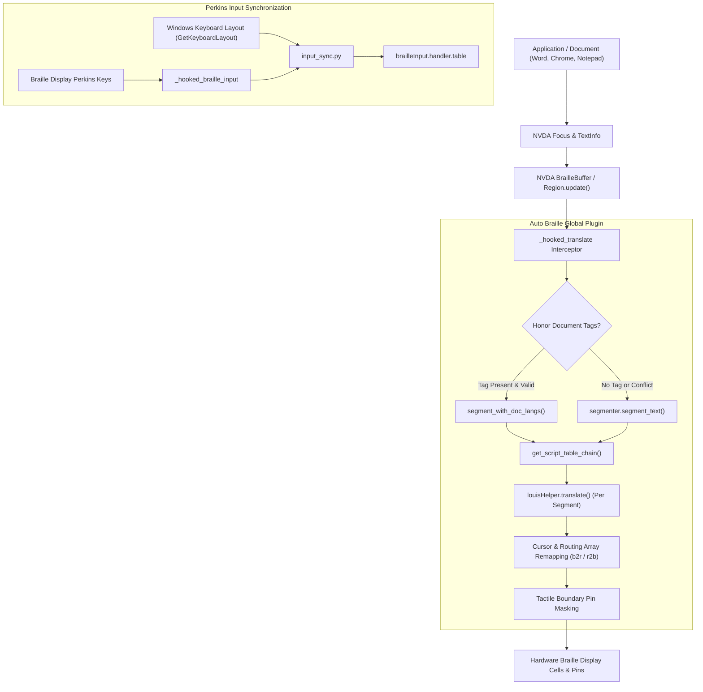

# Auto Braille: Technical Developer Guide & Architecture Manual

Welcome to the **Auto Braille** developer guide! This document provides an exhaustive architectural walkthrough, API specifications, and extension guidelines for developers and contributors working on Auto Braille for NVDA.

---

## Table of Contents

1. [Architecture Overview](#1-architecture-overview)
2. [Component Pipeline & Data Flow](#2-component-pipeline--data-flow)
3. [Deep Dive: Translation & Routing Remapping](#3-deep-dive-translation--routing-remapping)
4. [Deep Dive: Unicode Script Segmentation](#4-deep-dive-unicode-script-segmentation)
5. [Deep Dive: Bi-Directional Perkins Input Auto-Switching](#5-deep-dive-bi-directional-perkins-input-auto-switching)
6. [Deep Dive: Tactile Boundary Markers](#6-deep-dive-tactile-boundary-markers)
7. [Deep Dive: Document Language Tag Integration](#7-deep-dive-document-language-tag-integration)
8. [Adding New Writing Systems & Liblouis Tables](#8-adding-new-writing-systems--liblouis-tables)
9. [Build System & Automated CI/CD](#9-build-system--automated-cicd)
10. [Test Suites & Quality Assurance](#10-test-suites--quality-assurance)

---

## 1. Architecture Overview

Auto Braille operates as an NVDA Global Plugin (`globalPlugins/autoBraille`). It sits cleanly between NVDA's core presentation layer and the Liblouis translation engine.



### Module Responsibilities

| Module | File Path | Core Responsibility |
| :--- | :--- | :--- |
| **`__init__.py`** | `addon/globalPlugins/autoBraille/__init__.py` | Plugin lifecycle (`initialize`, `terminate`), event handlers (`event_gainFocus`), `louisHelper.translate` hook, settings panel GUI, and caret announcement script. |
| **`translator.py`** | `addon/globalPlugins/autoBraille/translator.py` | Multi-script translation orchestrator, table chain resolution, routing position stitching (`b2r`, `r2b`), cursor clamping, and tactile marker pin masking. |
| **`segmenter.py`** | `addon/globalPlugins/autoBraille/segmenter.py` | High-speed regex segmenter with disjoint Unicode script intervals and LRU caching for microsecond-level text partitioning. |
| **`scripts_data.py`** | `addon/globalPlugins/autoBraille/scripts_data.py` | Universal registry for 24+ global writing systems, BCP-47 tag mappings, Liblouis table prefixes/keywords, and Windows LANGID lookups. |
| **`input_sync.py`** | `addon/globalPlugins/autoBraille/input_sync.py` | Perkins braille keyboard auto-switching, Win32 layout detection (`GetKeyboardLayout`), table resolution, and cyclic input switching. |
| **`language_dialogs.py`** | `addon/globalPlugins/autoBraille/language_dialogs.py` | Accessible wxPython modal dialogs: `AddTableDialog` and `EditTableDialog` for configuring secondary tables. |

---

## 2. Component Pipeline & Data Flow

### The Translation Pipeline

1. **Interception:** When NVDA's braille buffer calls `Region.update()`, it invokes `louisHelper.translate(tableList, inbuf, typeform, mode, cursorPos)`.
2. **Fast-Path Check:** If Auto Braille is disabled, or if `inbuf` contains no characters belonging to any active secondary script (and no document tags / tactile markers), translation is dispatched immediately to the primary table chain in **under 2.7 microseconds**.
3. **Segmentation:** Mixed text is partitioned into contiguous character runs `(segment_text, start_index, end_index, script_id)`.
4. **Table Chain Assembly:** Each script is resolved to its respective Liblouis table chain (e.g. `['fa-ir-g1.utb', 'braille-patterns.cti']`).
5. **Per-Segment Translation:** `louisHelper.translate()` is called independently for each segment with localized `typeform`, `mode`, and relative `cursorPos`.
6. **Routing & Cursor Stitching:** Character-to-cell (`r2b`) and cell-to-character (`b2r`) arrays are offset-adjusted and concatenated.
7. **Tactile Pin Masking:** If enabled, Dot 8 (`0x80`) or Dot 7 (`0x40`) or Dots 7&8 (`0xC0`) are applied to the appropriate cells without changing array lengths.
8. **Cursor Clamping:** The final braille cursor position is clamped strictly within `[0, len(all_cells)]` to prevent any `LookupError`.

---

## 3. Deep Dive: Translation & Routing Remapping

In Liblouis, `translate()` produces four critical outputs:
```python
cells, b2r, r2b, cur = louisHelper.translate(tableList, inbuf, typeform=typeform, mode=mode, cursorPos=cursorPos)
```
- `cells`: List of integers representing 8-dot braille pin masks.
- `b2r` (braille to raw): Maps each cell index to the corresponding source character index in `inbuf`. Used when the user presses a **cursor routing key** on the braille display.
- `r2b` (raw to braille): Maps each character index in `inbuf` to the starting cell index in `cells`. Used by NVDA to position the braille cursor at the insertion point.
- `cur`: The cell position of the cursor (or `None`).

### Offsets & Concatenation Math

When stitching multiple segments together:
```python
cell_offset = len(all_cells)
all_cells.extend(cells)

# Offset cell-to-character routing
for p in b2r:
    all_b2r.append(start_idx + p)

# Offset character-to-cell routing
for p in r2b:
    all_r2b.append(cell_offset + p)

# Track cursor position
if cur is not None and final_cursor_pos is None:
    final_cursor_pos = cell_offset + cur
```

### Strict Cursor Clamping
To prevent NVDA crashes when the cursor is at the trailing edge of a document or beyond the buffer:
```python
if cursorPos is not None:
    if final_cursor_pos is None:
        if cursorPos >= text_len:
            final_cursor_pos = len(all_cells)
        elif cursorPos < len(all_r2b):
            final_cursor_pos = all_r2b[cursorPos]
        else:
            final_cursor_pos = len(all_cells)

    if len(all_cells) == 0:
        final_cursor_pos = None
    elif final_cursor_pos is not None:
        final_cursor_pos = max(0, min(final_cursor_pos, len(all_cells)))
```

---

## 4. Deep Dive: Unicode Script Segmentation

Script detection in `segmenter.py` uses precise, non-overlapping Unicode regex ranges:
- **Arabic / Persian:** `[\u0600-\u06FF\u0750-\u077F\u08A0-\u08FF\uFB50-\uFDFF\uFE70-\uFEFF]`
- **Cyrillic:** `[\u0400-\u04FF\u0500-\u052F\u2DE0-\u2DFF\uA640-\uA69F]`
- **Hebrew:** `[\u0590-\u05FF\uFB1D-\uFB4F]`
- **Greek:** `[\u0370-\u03FF\u1F00-\u1FFF]`
- **Indic / Devanagari:** `[\u0900-\u097F\uA8E0-\uA8FF]`
- **East Asian CJK:** `[\u4E00-\u9FFF\u3400-\u4DBF\uF900-\uFAFF]`
- **Latin / European:** `[a-zA-Z\u00C0-\u024F\u1E00-\u1EFF]`

### Neutral Token Absorption
Whitespace, numbers, and common punctuation (`.,;:!?()-"`) do not possess an inherent script. To prevent fragmentation, neutral sequences are absorbed into the surrounding script context:
```
"سلام " + "test" + " است." 
--> [("سلام ", "arabic_persian"), ("test ", "latin"), ("است.", "arabic_persian")]
```

---

## 5. Deep Dive: Bi-Directional Perkins Input Auto-Switching

The Perkins input synchronization architecture in `input_sync.py` hooks NVDA's `BrailleInputHandler.input()`:
```python
_orig_braille_input = getattr(brailleInput.BrailleInputHandler, "input", None)
if _orig_braille_input:
    brailleInput.BrailleInputHandler.input = _hooked_braille_input
```

### Win32 Keyboard Layout Resolution
When the user types on Perkins keys or switches focus:
1. `user32.GetForegroundWindow()` retrieves the active window.
2. `user32.GetWindowThreadProcessId()` retrieves the thread ID.
3. `user32.GetKeyboardLayout(thread_id)` retrieves the HKL / LANGID (e.g. `0x0429` for Persian, `0x0409` for English).
4. `input_sync.resolve_input_table_for_lang(lang_id)` matches against the active configured tables and sets `brailleInput.handler.table`.

---

## 6. Deep Dive: Tactile Boundary Markers

Tactile markers are injected in `translator.py` by applying bitwise OR masks to the cell integers:
- **Dot 8 (`0x80`):** Bottom-right pin of an 8-dot braille display.
- **Dot 7 (`0x40`):** Bottom-left pin of an 8-dot braille display.
- **Dots 7 and 8 (`0xC0`):** Both bottom pins raised simultaneously (underline).

```python
if cells:
    if tactile_marker == "dot8_first" and idx > 0 and script != segments[idx - 1][3]:
        cells = [cells[0] | 0x80] + cells[1:]
    elif tactile_marker == "dot7_first" and idx > 0 and script != segments[idx - 1][3]:
        cells = [cells[0] | 0x40] + cells[1:]
    elif tactile_marker == "dots78_secondary" and script != primary_script:
        cells = [c | 0xC0 for c in cells]
```
Because the cell count is unaltered, cursor routing keys and text cursor positions remain 100% aligned.

---

## 7. Deep Dive: Document Language Tag Integration

Feature 4 retrieves official document language tags from NVDA's `TextInfo` formatting without monkey-patching core classes:
1. When translating text in a browser or Word document, `api.getFocusObject()` provides the active control.
2. `TextInfo.getTextWithFields()` yields `FieldCommand("formatChange", {"language": "fa-IR"})`.
3. `scripts_data.resolve_doc_lang_to_script("fa-IR")` resolves the tag to `arabic_persian`.
4. **Accuracy Validator:** `is_script_compatible(chunk, script_id)` validates that the text does not contain conflicting alphabets. If an author carelessly tags Persian text as English, Auto Braille detects the conflict and falls back to Unicode script detection.

---

## 8. Adding New Writing Systems & Liblouis Tables

To register a new writing system, edit `addon/globalPlugins/autoBraille/scripts_data.py`:
```python
ScriptInfo(
    id="my_script",
    name="My Script Name",
    family="my_family",
    family_name="My Family Display Name",
    pattern=r"[\uXXXX-\uYYYY]",
    default_output_table="my-table-g1.utb",
    default_input_table="my-table-g1.utb",
    table_prefixes=("my-",),
    keywords=("myscript",),
    lang_ids=(0xXXXX,),
    default_enabled=False,
)
```
Add BCP-47 tag mappings in `DOC_LANG_MAP`:
```python
"my": "my_script",
"my-XX": "my_script",
```
Auto Braille's dynamic configuration, GUI dialogs, table-to-script resolution, and Perkins input sync will automatically recognize the new writing system!

---

## 9. Build System & Automated CI/CD

### Building via Python (`build.py`)
```bash
python build.py
```
Produces `autoBraille-1.0.0.nvda-addon` in the root repository folder, cleanly verifying `manifest.ini` and excluding `__pycache__`, tests, and docs.

### Building via PowerShell (`build.ps1`)
```powershell
.\build.ps1
```

### GitHub Actions CI/CD (`.github/workflows/release.yml`)
Pushes to `main` run automated tests. Pushing a tag (`v*`) automatically builds the `.nvda-addon` bundle and attaches it as a GitHub Release asset!

---

## 10. Test Suites & Quality Assurance

Run the test suite using Python:
```bash
python tests/test_features_3_4.py
python tests/test_tables_mode.py
python tests/test_segmenter.py
```
All unit tests mock NVDA internal modules (`braille`, `brailleTables`, `config`, `louisHelper`, `wx`, `textInfos`), enabling complete offline execution without launching NVDA.
