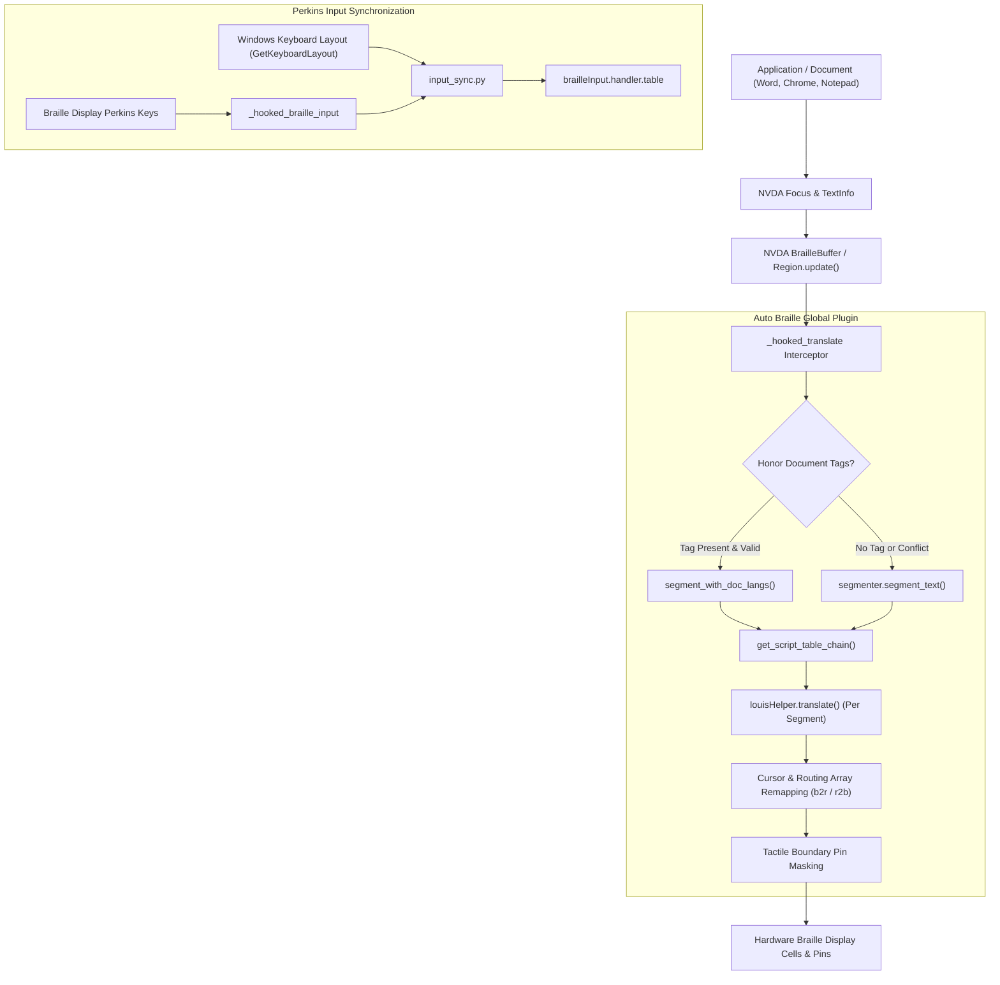
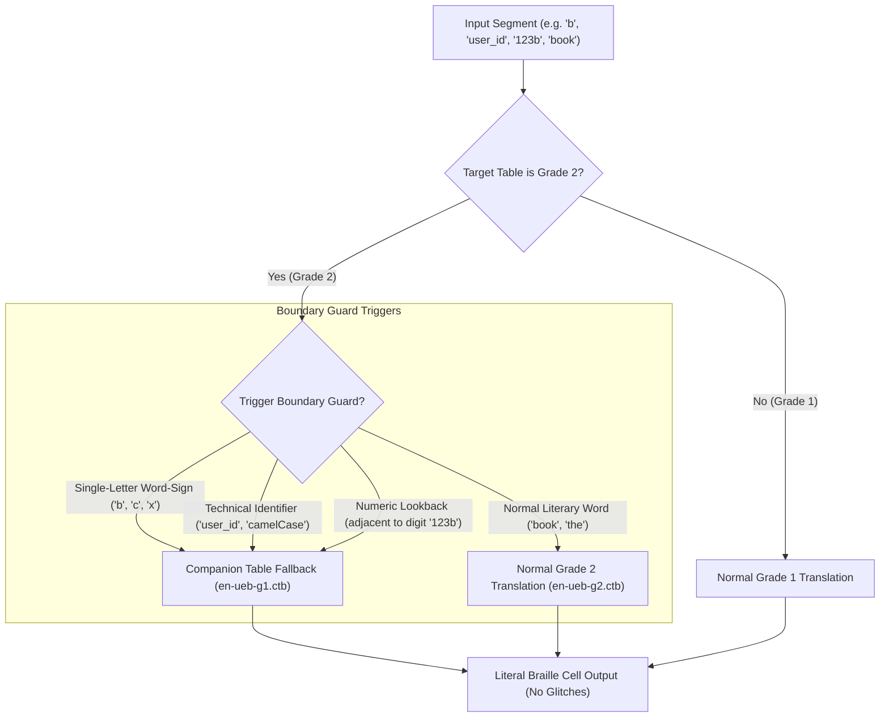

# Auto Braille: Technical Developer Guide & Architecture Manual

Welcome to the **Auto Braille** developer guide! This document provides an exhaustive architectural walkthrough, API specifications, and extension guidelines for developers and contributors working on Auto Braille for NVDA.

---

## Table of Contents

1. [Architecture Overview](#1-architecture-overview)
2. [Component Pipeline & Data Flow](#2-component-pipeline--data-flow)
3. [Deep Dive: Translation & Routing Remapping](#3-deep-dive-translation--routing-remapping)
4. [Deep Dive: Unicode Script Segmentation](#4-deep-dive-unicode-script-segmentation)
5. [Deep Dive: Bi-Directional Perkins Input Auto-Switching](#5-deep-dive-bi-directional-perkins-input-auto-switching)
6. [Deep Dive: Tactile Boundary Markers](#6-deep-dive-tactile-boundary-markers)
7. [Deep Dive: Document Language Tag Integration](#7-deep-dive-document-language-tag-integration)
8. [Deep Dive: Contracted Braille (Grade 2) & Boundary Guarding](#8-deep-dive-contracted-braille-grade-2--boundary-guarding)
9. [Deep Dive: 3-Tier Multi-Language Architecture & Intra-Script Disambiguation](#9-deep-dive-3-tier-multi-language-architecture--intra-script-disambiguation)
10. [Deep Dive: One-Click Setup Wizard & Windows Keyboard Detection](#10-deep-dive-one-click-setup-wizard--windows-keyboard-detection)
11. [Adding New Writing Systems & Liblouis Tables](#11-adding-new-writing-systems--liblouis-tables)
12. [Localization & Internationalization (gettext)](#12-localization--internationalization-gettext)
13. [Build System & Automated CI/CD](#13-build-system--automated-cicd)
14. [Test Suites & Quality Assurance](#14-test-suites--quality-assurance)

---

## 1. Architecture Overview

Auto Braille operates as an NVDA Global Plugin (`globalPlugins/autoBraille`). It sits cleanly between NVDA's core presentation layer and the Liblouis translation engine.



### Module Responsibilities

| Module | File Path | Core Responsibility |
| :--- | :--- | :--- |
| **`__init__.py`** | `addon/globalPlugins/autoBraille/__init__.py` | Plugin lifecycle (`initialize`, `terminate`), event handlers (`event_gainFocus`), `louisHelper.translate` hook, secure mode enforcement, settings panel GUI, and caret announcement script. |
| **`translator.py`** | `addon/globalPlugins/autoBraille/translator.py` | Multi-script translation orchestrator, table chain resolution, routing position stitching (`b2r`, `r2b`), cursor clamping, and tactile marker pin masking. |
| **`segmenter.py`** | `addon/globalPlugins/autoBraille/segmenter.py` | High-speed regex segmenter with disjoint Unicode script intervals, atomic numeric literal preservation, and LRU caching for microsecond-level text partitioning. |
| **`scripts_data.py`** | `addon/globalPlugins/autoBraille/scripts_data.py` | Universal registry for 24+ global writing systems, BCP-47 tag mappings, Liblouis table prefixes/keywords, and Windows LANGID lookups. |
| **`input_sync.py`** | `addon/globalPlugins/autoBraille/input_sync.py` | Perkins braille keyboard auto-switching, 64-bit safe Win32 layout detection (`GetKeyboardLayout`), table resolution, and cyclic input switching. |
| **`language_dialogs.py`** | `addon/globalPlugins/autoBraille/language_dialogs.py` | Accessible wxPython modal dialogs: `AddTableDialog` and `EditTableDialog` for configuring secondary tables. |
| **`generate_pot.py`** | `generate_pot.py` | Standalone AST extractor parsing all translatable `_()` strings and `# Translators:` comments into `addon/locale/autoBraille.pot`. |

---

## 2. Component Pipeline & Data Flow

### The Translation Pipeline

1. **Interception:** When NVDA's braille buffer calls `Region.update()`, it invokes `louisHelper.translate(tableList, inbuf, typeform, mode, cursorPos)`.
2. **Fast-Path Check:** If Auto Braille is disabled, or if `inbuf` contains no characters belonging to any active secondary script (and no document tags / tactile markers), translation is dispatched immediately to the primary table chain in **under 2.7 microseconds**.
3. **Segmentation:** Mixed text is partitioned into contiguous character runs `(segment_text, start_index, end_index, script_id)`.
4. **Table Chain Assembly:** Each script is resolved to its respective Liblouis table chain (e.g. `['fa-ir-g1.utb', 'braille-patterns.cti']`).
5. **Per-Segment Translation:** `louisHelper.translate()` is called independently for each segment with localized `typeform`, `mode`, and relative `cursorPos`.
6. **Routing & Cursor Stitching:** Character-to-cell (`r2b`) and cell-to-character (`b2r`) arrays are offset-adjusted and concatenated.
7. **Tactile Pin Masking:** If enabled, Dot 8 (`0x80`) or Dot 7 (`0x40`) or Dots 7&8 (`0xC0`) are applied to the appropriate cells without changing array lengths.
8. **Cursor Clamping:** The final braille cursor position is clamped strictly within `[0, len(all_cells)]` to prevent any `LookupError`.

---

## 3. Deep Dive: Translation & Routing Remapping

In Liblouis, `translate()` produces four critical outputs:
```python
cells, b2r, r2b, cur = louisHelper.translate(tableList, inbuf, typeform=typeform, mode=mode, cursorPos=cursorPos)
```
- `cells`: List of integers representing 8-dot braille pin masks.
- `b2r` (braille to raw): Maps each cell index to the corresponding source character index in `inbuf`. Used when the user presses a **cursor routing key** on the braille display.
- `r2b` (raw to braille): Maps each character index in `inbuf` to the starting cell index in `cells`. Used by NVDA to position the braille cursor at the insertion point.
- `cur`: The cell position of the cursor (or `None`).

### Offsets & Concatenation Math

When stitching multiple segments together:
```python
cell_offset = len(all_cells)
all_cells.extend(cells)

# Offset cell-to-character routing
for cell_idx in b2r:
    all_b2r.append(start_idx + cell_idx)

# Offset character-to-cell routing
for char_idx in r2b:
    all_r2b.append(cell_offset + char_idx)

# Track cursor position
if cur is not None and final_cursor_pos is None:
    final_cursor_pos = cell_offset + cur
```

### Strict Cursor Clamping
To prevent NVDA crashes when the cursor is at the trailing edge of a document or beyond the buffer:
```python
if cursorPos is not None:
    if final_cursor_pos is None:
        if cursorPos >= text_len:
            final_cursor_pos = len(all_cells)
        elif cursorPos < len(all_r2b):
            final_cursor_pos = all_r2b[cursorPos]
        else:
            final_cursor_pos = len(all_cells)

    if len(all_cells) == 0:
        final_cursor_pos = None
    elif final_cursor_pos is not None:
        final_cursor_pos = max(0, min(final_cursor_pos, len(all_cells)))
```

---

## 4. Deep Dive: Unicode Script Segmentation

Script detection in `segmenter.py` uses precise, non-overlapping Unicode regex ranges:
- **Arabic / Persian:** `[\u0600-\u06FF\u0750-\u077F\u08A0-\u08FF\uFB50-\uFDFF\uFE70-\uFEFF]`
- **Cyrillic:** `[\u0400-\u04FF\u0500-\u052F\u2DE0-\u2DFF\uA640-\uA69F]`
- **Hebrew:** `[\u0590-\u05FF\uFB1D-\uFB4F]`
- **Greek:** `[\u0370-\u03FF\u1F00-\u1FFF]`
- **Indic / Devanagari:** `[\u0900-\u097F\uA8E0-\uA8FF]`
- **East Asian CJK:** `[\u4E00-\u9FFF\u3400-\u4DBF\uF900-\uFAFF]`
- **Latin / European:** `[a-zA-Z\u00C0-\u024F\u1E00-\u1EFF]`

### Neutral Token Absorption & Contiguous Numeric Literal Preservation
Whitespace, numbers, and common punctuation (`.,;:!?()-"`) do not possess an inherent script. To prevent fragmentation, neutral sequences are absorbed into the surrounding script context:
```
"سلام " + "test" + " است." 
--> [("سلام ", "arabic_persian"), ("test ", "latin"), ("است.", "arabic_persian")]
```

**Atomic Number Preservation:** When neutral punctuation and whitespace surround numbers between different writing systems, standard neutral splitting could inadvertently slice numbers across script boundaries. `segmenter.py` enforces contiguous digit boundary preservation: contiguous Arabic (`[0-9]`) or Indic/Persian (`[۰-۹]`) digits are retained as atomic units and associated with their respective script context, preventing garbled mathematical or numerical expressions.

---

## 5. Deep Dive: Bi-Directional Perkins Input Auto-Switching

The Perkins input synchronization architecture in `input_sync.py` hooks NVDA's `BrailleInputHandler.input()`:
```python
bih = getattr(brailleInput, "BrailleInputHandler", None)
current_input = getattr(bih, "input", None) if bih else None
if bih and current_input and current_input != _hooked_braille_input:
    _orig_braille_input = current_input
    bih.input = _hooked_braille_input
```

### 64-bit Safe Win32 Ctypes Binding
To prevent 64-bit pointer truncation and `ERROR_INVALID_WINDOW_HANDLE` crashes on modern 64-bit Windows installations running NVDA, `input_sync.py` explicitly declares `argtypes` and `restype` using `ctypes.wintypes`:
```python
_user32.GetForegroundWindow.argtypes = []
_user32.GetForegroundWindow.restype = wintypes.HWND

_user32.GetWindowThreadProcessId.argtypes = [wintypes.HWND, ctypes.POINTER(wintypes.DWORD)]
_user32.GetWindowThreadProcessId.restype = wintypes.DWORD

_user32.GetKeyboardLayout.argtypes = [wintypes.DWORD]
_user32.GetKeyboardLayout.restype = wintypes.HKL
```

### Win32 Keyboard Layout Resolution
When the user types on Perkins keys or switches focus:
1. `user32.GetForegroundWindow()` retrieves the active window handle (`HWND`).
2. `user32.GetWindowThreadProcessId()` retrieves the thread ID (`DWORD`).
3. `user32.GetKeyboardLayout(thread_id)` retrieves the layout handle (`HKL`), from which the 16-bit LANGID is extracted (`HKL & 0xFFFF`).
4. `input_sync.resolve_input_table_for_lang(lang_id)` matches against the active configured tables and sets `brailleInput.handler.table`.

---

## 6. Deep Dive: Tactile Boundary Markers

Tactile markers are injected in `translator.py` by applying bitwise OR masks to the cell integers using named constants conforming to ISO/TR 11548-1:
```python
BRAILLE_DOT_7: int = 0x40        # Lower-left dot (Pin 7)
BRAILLE_DOT_8: int = 0x80        # Lower-right dot (Pin 8)
BRAILLE_DOTS_7_8: int = 0xC0     # Underline indicator (Pins 7 and 8)
```

### Multi-Segment and Single-Segment Support
Tactile indicators are applied both across multi-segment transitions and single-segment secondary lines:
```python
# For single-segment lines where the entire text belongs to a secondary script:
if cells and seg_script != primary_script:
    if tactile_marker == "dot8_first":
        cells = [cells[0] | BRAILLE_DOT_8] + cells[1:]
    elif tactile_marker == "dot7_first":
        cells = [cells[0] | BRAILLE_DOT_7] + cells[1:]
    elif tactile_marker == "dots78_secondary":
        cells = [cell | BRAILLE_DOTS_7_8 for cell in cells]

# For multi-segment lines at transition boundaries:
if cells:
    if tactile_marker == "dot8_first" and idx > 0 and script != segments[idx - 1][3]:
        cells = [cells[0] | BRAILLE_DOT_8] + cells[1:]
    elif tactile_marker == "dot7_first" and idx > 0 and script != segments[idx - 1][3]:
        cells = [cells[0] | BRAILLE_DOT_7] + cells[1:]
    elif tactile_marker == "dots78_secondary" and script != primary_script:
        cells = [cell | BRAILLE_DOTS_7_8 for cell in cells]
```
Because the cell count is unaltered, cursor routing keys and text cursor positions remain 100% aligned.

---

## 7. Deep Dive: Document Language Tag Integration

Feature 4 retrieves official document language tags from NVDA's `TextInfo` formatting without monkey-patching core classes:
1. When translating text in a browser or Word document, `api.getFocusObject()` provides the active control.
2. `TextInfo.getTextWithFields()` yields `FieldCommand("formatChange", {"language": "fa-IR"})`.
3. `scripts_data.resolve_doc_lang_to_script("fa-IR")` resolves the tag to `arabic_persian`.
4. **Accuracy Validator:** `is_script_compatible(chunk, script_id)` validates that the text does not contain conflicting alphabets. If an author carelessly tags Persian text as English, Auto Braille detects the conflict and falls back to Unicode script detection.

---

## 8. Deep Dive: Contracted Braille (Grade 2) & Boundary Guarding

Contracted Braille uses ligatures and abbreviations to shorten words (e.g., in English UEB Grade 2, standalone `b` = "but", `c` = "can", `x` = "it"). In multi-script text, naive string slicing extracts single foreign letters or code identifiers in isolation, causing Liblouis Grade 2 tables to accidentally contract them into full words or corrupt technical identifiers.

Auto Braille implements a **5-Layer Boundary Guarding System**:



### 1. Companion Table Resolution (`GRADE2_COMPANION_MAP`)
Every Grade 2 contracted table is paired with its Grade 1 uncontracted counterpart in `scripts_data.py`:
* `en-ueb-g2.ctb` &harr; `en-ueb-g1.ctb`
* `ar-ar-g2.ctb` &harr; `ar-ar-g1.utb`
* `de-g2.ctb` &harr; `de-g1.ctb`
* `es-g2.ctb` &harr; `es-g1.ctb`
* `fr-bfu-g2.ctb` &harr; `fr-bfu-comp8.ctb`
* `ru-g2.ctb` &harr; `ru-litbrl.ctb`

### 2. Single-Letter Word-Sign Protection (`is_single_letter_wordsign_candidate`)
When an isolated letter (`b`, `c`, `x`) is flanked by non-Latin text (e.g. `گزینه b`), Auto Braille intercepts the token and routes it through the Grade 1 companion table. The reader sees the letter `b`, never the word `but`!

### 3. Code & Identifier Guard (`is_technical_identifier`)
Tokens containing programming symbols (`_`, `\`, `/`, `@`, `$`, `#`) or CamelCase capitalization (e.g. `fileName`, `user_id`) are routed through the companion Grade 1 table to prevent code corruption.

### 4. Numeric Mode Boundary Lookback
If a Latin segment immediately follows a digit without whitespace (e.g. `123b` or `۱۲۳a`), Auto Braille detects the boundary lookback and translates the letter with Grade 1 to prevent numeric mode bleed.

---

## 9. Deep Dive: 3-Tier Multi-Language Architecture & Intra-Script Disambiguation

To distinguish between languages sharing the same script (e.g. Persian vs. Arabic, or English vs. French/German) without flickering on loanwords, Auto Braille implements a 3-tier hierarchy:

* **Tier 1 (Cross-Script):** 100% deterministic Unicode script segmentation across disjoint alphabets.
* **Tier 2 (Loanword Absorption):** Persian loanwords with Arabic letters (`دایرة‌المعارف`, `نهایة`, `خاصةً`) and English words with accents (`café`, `résumé`, `über`) stay stably in their primary table.
* **Tier 3 (Intra-Script Disambiguation):** When multiple tables for the same script are active:
  1. Document language markup spans (`<span lang="ar">`, `<span lang="fr">`) take top priority.
  2. Multi-word grammatical clauses with 2+ distinct stop words (e.g. `في`, `من`, `على` for Arabic; `la`, `dans`, `nous` for French) route to the target language's table.
  3. Single loanwords or ambiguous text remain on the base table with **zero flapping**.
* **Dynamic Defaults for Non-Latin Primary Users:** When NVDA's primary translation table is Persian (`fa-ir-g1.utb`), Arabic (`ar-ar-g1.utb`), or Russian (`ru-litbrl.ctb`), the secondary table dynamically defaults to **English UEB (`en-ueb-g1.ctb`)**.

---

## 10. Deep Dive: One-Click Setup Wizard & Windows Keyboard Detection

The One-Click Setup Wizard allows users to automatically discover all installed Windows keyboard languages and configure their optimal Liblouis braille output and Perkins input tables in a single step.

### 1. In-Memory & Read-Only Detection Architecture
Auto Braille implements a zero-attack-surface discovery pipeline:
* **Primary (In-Memory Win32 API):** Uses `user32.GetKeyboardLayoutList()` to query active layouts directly from the window manager thread in RAM.
  - Formally typed using 64-bit safe ctypes pointers (`hkl_type = getattr(wintypes, "HKL", ctypes.c_void_p)`).
* **Secondary (Read-Only Registry Fallback):** Queries `HKEY_CURRENT_USER\Keyboard Layout\Preload` strictly with `winreg.KEY_READ`.
  - Zero write access: cannot modify, inject, or tamper with the registry.
  - Strict hex sanitization: each value is matched against `^[0-9a-fA-F]{1,8}$` and converted to `int(val, 16) & 0xFFFF`.

### 2. 3-Tier Fallback Hierarchy & Deduplication
To handle dozens of regional Windows dialects (e.g. UK vs US English; Saudi vs Egyptian Arabic):
1. **Tier 1 (Exact LANGID):** `scripts_data.LANG_ID_TO_TABLE[lang_id]`
2. **Tier 2 (Primary Language Mask):** `lang_id & 0x03FF` masks out dialect sub-languages, unifying all English dialects to `0x0009` and all Arabic dialects to `0x0001`.
3. **Tier 3 (Script Family Registry):** `scripts_data.LANG_ID_TO_SCRIPT` maps remaining writing systems to their default output table.
* **Deduplication:** Multiple installed variants of the same language are merged so only one candidate table is proposed.

### 3. Primary Table Protection & Catalog Validation
* The detected layout matching NVDA's active translation table is identified as the **Primary Language** and is never added to secondary candidates.
* Every candidate is dynamically verified against `brailleTables.listTables()`. If a table is not installed in the user's NVDA version, compatible prefix fallbacks are checked, or the layout is noted in the preview dialog.

### 4. Accessible Wizard Dialog (`AutoDetectWizardDialog`)
* Renders a `wx.CheckListBox` with all detected candidate languages pre-checked.
* Features an **Edit Table...** button opening `EditTableDialog` for any highlighted language, allowing the user to select Computer Braille or Grade 2 before applying.
* Directly appends confirmed tables to the settings list and saves configuration.

---

## 11. Adding New Writing Systems & Liblouis Tables

To register a new writing system, edit `addon/globalPlugins/autoBraille/scripts_data.py`:
```python
ScriptInfo(
    id="my_script",
    name="My Script Name",
    family="my_family",
    family_name="My Family Display Name",
    pattern=r"[\uXXXX-\uYYYY]",
    default_output_table="my-table-g1.utb",
    default_input_table="my-table-g1.utb",
    table_prefixes=("my-",),
    keywords=("myscript",),
    lang_ids=(0xXXXX,),
    default_enabled=False,
)
```
Add BCP-47 tag mappings in `DOC_LANG_MAP`:
```python
"my": "my_script",
"my-XX": "my_script",
```
Auto Braille's dynamic configuration, GUI dialogs, table-to-script resolution, and Perkins input sync will automatically recognize the new writing system!

> [!NOTE]
> Recent additions include complete definitions for **Sinhala** (`sin-in-g1.utb`), **Armenian** (`hy.ctb`), and expanded multi-prefix matching for **Georgian** (`ka.`, `ka-`, `ka.utb`). All 132 `DOC_LANG_MAP` entries are formally validated against active script IDs.

---

## 12. Localization & Internationalization (gettext)

Auto Braille strictly enforces NVDA Add-on Store standards for translatability:

### 1. Translator Comments Convention
Every user-facing string wrapped with `_("...")` must be immediately preceded by a `# Translators:` comment explaining the context, controls, or placeholders:
```python
# Translators: Label for the output braille table selector in the Add Table dialog.
self.outputChoice = sHelper.addLabeledControl(
    _("&Output braille table:"), wx.Choice, choices=out_choices
)
```

### 2. Standalone Catalog Generator (`generate_pot.py`)
Auto Braille includes a zero-dependency AST parser [generate_pot.py](file:///c:/Users/maman/.gemini/antigravity/scratch/autoBraille/generate_pot.py) that inspects manifest metadata and Python source code:
```bash
py.exe generate_pot.py
```
This generates `addon/locale/autoBraille.pot` with all 44+ translatable messages, their exact line references, and associated `# Translators:` guidance comments.

### 3. Adding Translated PO Files
Translators create `addon/locale/<lang>/LC_MESSAGES/autoBraille.po` using POEdit or standard gettext tools. During packaging, `build.py` automatically bundles all compiled catalogs.

---

## 13. Build System & Automated CI/CD

### Building via Python (`build.py`)
Auto Braille utilizes a standalone packaging script:
```bash
py.exe build.py
```
This inspects `addon/manifest.ini`, excludes bytecode (`.pyc`, `__pycache__`) and development files, and packages a clean distributable archive:
`dist/autoBraille-1.0.2.nvda-addon`

### Building via PowerShell (`build.ps1`)
On Windows, you can package and optionally run all tests in one step:
```powershell
powershell -ExecutionPolicy Bypass -File build.ps1 -RunTests
```

### GitHub Actions CI/CD (`.github/workflows/release.yml`)
* Pushes and PRs on `main` execute unit tests across Windows runners.
* Pushing a version tag (`v*`, e.g. `v1.0.2`) triggers automated testing, packages `autoBraille-X.X.X.nvda-addon`, and creates a GitHub Release with the bundle attached.

---

## 14. Test Suites & Quality Assurance

Auto Braille features a comprehensive 7-suite offline testing framework requiring zero running NVDA instances:

| Suite | File Path | Focus Area |
| :--- | :--- | :--- |
| **Audit Fixes** | `tests/test_audit_fixes.py` | 64-bit Win32 pointer types, 132 language mappings, Georgian prefix matching, gettext fallbacks, atomic numbers, single-segment tactile pins, brace formatting in caret announcement, and monkey-patch idempotency. |
| **Tables & Sync** | `tests/test_tables_mode.py` | Automatic vs. explicit primary tables, secondary table detection, and Perkins layout-to-table resolution across Windows LANGIDs. |
| **Doc Lang & Tactile** | `tests/test_doc_lang_and_tactile.py` | Document language tag parsing, HTML/Word `lang` validation, tactile boundary indicators (`dot8_first`, `dot7_first`, `dots78_secondary`), spoken/braille announcements, and settings panel GUI. |
| **Segmenter** | `tests/test_segmenter.py` | Unicode script segmentation across Persian, Russian, Hebrew, Greek, and English sentences with neutral gap absorption. |
| **Intra-Script** | `tests/test_intra_script.py` | 3-tier language detection, exclusive lexical marker scoring (Persian vs Arabic, Ukrainian/Belarusian vs Russian, Urdu/Kurdish), n-gram frequency fallback, and document tag override. |
| **Grade 2 Boundary** | `tests/test_grade2_boundary.py` | Contracted Braille companion mapping, boundary guarding for single-letter wordsigns (`b` -> `but` prevention), code identifiers (`user_id`), numeric boundaries (`123b`), and cursor routing offset preservation. |
| **Auto-Detect Keyboards** | `tests/test_auto_detect_keyboards.py` | 64-bit safe `GetKeyboardLayoutList`, read-only registry sanitization, 3-tier dialect resolution, variant deduplication, primary table protection, Liblouis catalog validation, and wizard UI integration. |

### Running Unit Tests
Execute individual suites using Python:
```bash
py.exe tests/test_audit_fixes.py
py.exe tests/test_tables_mode.py
py.exe tests/test_doc_lang_and_tactile.py
py.exe tests/test_segmenter.py
py.exe tests/test_intra_script.py
py.exe tests/test_grade2_boundary.py
py.exe tests/test_auto_detect_keyboards.py
```
Or run the complete suite automatically through `build.ps1 -RunTests`.

### Test Mock Isolation Pattern
All test suites reuse existing mock modules in `sys.modules` (`sys.modules.get(...)`) rather than blindly overwriting them, guaranteeing clean module state and preventing mock collision during sequential test execution.
